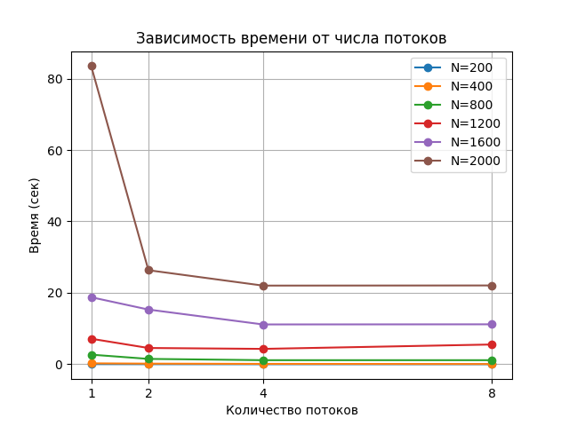

# Отчет по лабораторной работе №3

## Зиминой Евгении (гр. 6214-100503D)

---

### Цель работы

Исследовать эффективность параллельного выполнения программы умножения квадратных матриц с использованием технологии MPI. Определить зависимость времени выполнения от размера матриц и количества потоков.

---

### Исходные данные

Файлы:
- A_matrix.txt — матрица A  
- B_matrix.txt — матрица B  

Матрицы генерируются случайным образом в программе.

---

### Выходные данные

- Result.txt — результат перемножения матриц  
- время выполнения программы  
- объем задачи  
- проверка корректности (Python, NumPy)

---

### Исходный код решения

```cpp
#include <mpi.h>
#include <iostream>
#include <fstream>
#include <ctime>
#include <cstdlib>

void multiply(int n, int A[1000][1000], int B[1000][1000], int C[1000][1000])
{
    int i, j, k;
    for (i = 0; i < n; i++)
        for (j = 0; j < n; j++) {
            C[i][j] = 0;
            for (k = 0; k < n; k++)
                C[i][j] += A[i][k] * B[k][j];
        }
}

int main(int argc, char** argv)
{
    MPI_Init(&argc, &argv);

    int rank, size;
    MPI_Comm_rank(MPI_COMM_WORLD, &rank);
    MPI_Comm_size(MPI_COMM_WORLD, &size);

    int n;

    if (rank == 0) {
        std::cout << "Enter matrix size: ";
        std::cin >> n;
    }

    MPI_Bcast(&n, 1, MPI_INT, 0, MPI_COMM_WORLD);

    static int A[2000][2000];
    static int B[2000][2000];
    static int C[2000][2000];

    std::ofstream Afile("A_matrix.txt");
    std::ofstream Bfile("B_matrix.txt");

    srand(time(0) + rank);

    if (rank == 0) {

        std::ofstream Afile("A_matrix.txt");
        std::ofstream Bfile("B_matrix.txt");

        Afile << n << "\n";
        Bfile << n << "\n";

        for (int i = 0; i < n; i++) {
            for (int j = 0; j < n; j++) {
                A[i][j] = rand() % 10;
                B[i][j] = rand() % 10;

                Afile << A[i][j] << " ";
                Bfile << B[i][j] << " ";
            }
            Afile << "\n";
            Bfile << "\n";
        }

        Afile.close();
        Bfile.close();
    }

    MPI_Bcast(B, 2000 * 2000, MPI_INT, 0, MPI_COMM_WORLD);

    int rows = n / size;

    static int local_A[2000][2000];
    static int local_C[2000][2000];

    MPI_Scatter(A, rows * 2000, MPI_INT,
        local_A, rows * 2000, MPI_INT,
        0, MPI_COMM_WORLD);

    double start = MPI_Wtime();


    for (int i = 0; i < rows; i++)
        for (int j = 0; j < n; j++) {
            local_C[i][j] = 0;
            for (int k = 0; k < n; k++)
                local_C[i][j] += local_A[i][k] * B[k][j];
        }

    double end = MPI_Wtime();


    MPI_Gather(local_C, rows * 2000, MPI_INT,
        C, rows * 2000, MPI_INT,
        0, MPI_COMM_WORLD);


    if (rank == 0) {

        std::ofstream Cfile("Result.txt");

        Cfile << n << "\n";
        for (int i = 0; i < n; i++) {
            for (int j = 0; j < n; j++)
                Cfile << C[i][j] << " ";
            Cfile << "\n";
        }

        Cfile.close();

        std::cout << "\n======== RESULT ========\n";
        std::cout << "Matrix size: " << n << " x " << n << "\n";
        std::cout << "Processes: " << size << "\n";
        std::cout << "Time: " << (end - start) << " sec\n";
        std::cout << "Operations: " << (long long)n * n * n << "\n";
    }

    MPI_Finalize();
    return 0;
}
```
## Проверка корректности

```python
import numpy as np

A = np.loadtxt("A_matrix.txt", skiprows=1)
B = np.loadtxt("B_matrix.txt", skiprows=1)
C = np.loadtxt("Result.txt", skiprows=1)

R = A @ B

if (R == C).all():
    print("Matrix multiplication is correct.")
else:
    print("Matrix multiplication is wrong.")
```
## Результаты экспериментов
| N (размер) | Потоки | Время (сек) | Объём задачи (N³) |
|------------|--------|-------------|-------------------|
| 200        | 1      |0,0386625    |8000000            |
| 200        | 2      |0,0224523    |8000000            |
| 200        | 4      |0,0106422    |8000000            |
| 200        | 8      |0,107497     |8000000            |
| 400        | 1      |0,263249     |64000000           |
| 400        | 2      |0,179851     |64000000           |
| 400        | 4      |0,113903     |64000000           |
| 400        | 8      |0,0718021    |64000000           |
| 800        | 1      |2,69364      |512000000          |
| 800        | 2      |1,50575      |512000000          |
| 800        | 4      |1,14433      |512000000          |
| 800        | 8      |1,14472      |512000000          |
| 1200       | 1      |7,14768      |1728000000         |
| 1200       | 2      |4,56051      |1728000000         |
| 1200       | 4      |4,308        |1728000000         |
| 1200       | 8      |5,53549      |1728000000         |
| 1600       | 1      |18,772       |4096000000         |
| 1600       | 2      |15,3196      |4096000000         |
| 1600       | 4      |11,1531      |4096000000         |
| 1600       | 8      |11,1892      |4096000000         |
| 2000       | 1      |83,5087      |8000000000         |
| 2000       | 2      |26,3364      |8000000000         |
| 2000       | 4      |22,0287      |8000000000         |
| 2000       | 8      |22,0688      |8000000000         |

## Анализ результатов
В ходе экспериментов была проверена зависимость времени выполнения программы от размера матрицы и количества потоков.

С увеличением размера матриц время выполнения программы значительно возрастает, так как алгоритм имеет сложность O(N³).

При увеличении количества процессов наблюдается уменьшение времени выполнения. Наибольшее ускорение достигается при переходе от 1 к 2 и 4 процессам.

При дальнейшем увеличении числа процессов прирост производительности уменьшается, что связано с затратами на обмен данными между процессами.

## График зависимости времени от количества потоков



## Вывод
В данной работе была реализована параллельная версия умножения матриц с использованием MPI.

Проведённые эксперименты показали, что использование параллельных вычислений позволяет значительно сократить время выполнения программы при больших размерах матриц.

Но при этом рост числа процессов имеет свои пределы из-за дополнительных затрат.
